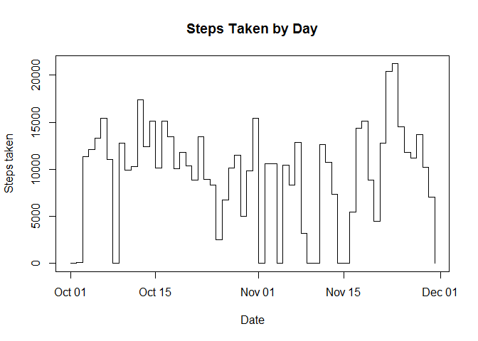
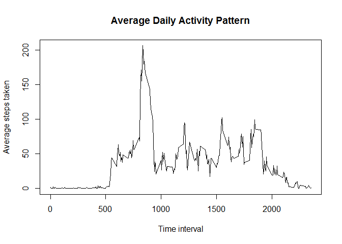
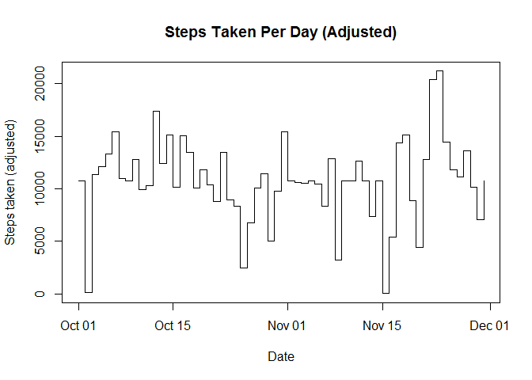
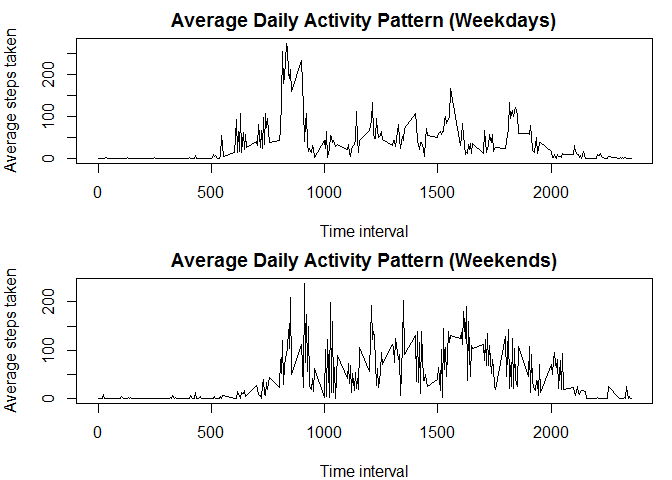

# Reproducible Research: Peer Assessment 1


## Loading and preprocessing the data

  Using the read.csv function to read the dataset

```r
x<-read.csv("activity.csv")

class(x$date)
```

```
## [1] "factor"
```
  The "date" column is of class "factor", which can be used effectively to subset the required data

## What is mean total number of steps taken per day?

  Setting up a for loop to subset the data set by day


```r
i <- 1

step<-levels(x$date)

s<-vector("numeric")

for (i in 1:length(step)){
  y<-x[x$date==step[i],]
  
  q<-sum(y[,1], na.rm=TRUE)
  
  s<-c(s,q)
  
}
```

  Histogram of steps taken by day


```r
plot(as.Date(step),s,type="s", xlab="Date", ylab="Steps taken", main="Steps Taken by Day")
```

 

  Mean and Median outputs

```r
mean(s)
```

```
## [1] 9354.23
```

```r
median(s)
```

```
## [1] 10395
```

## What is the average daily activity pattern?

  Setting up a for loop to subset by time interval

```r
i<-1

p<-vector("numeric")

step2<-levels(as.factor(x$interval))

for (i in 1:length(step2)){
  y<-x[x$interval==step2[i],]
  
  q<-mean(y[,1], na.rm=TRUE)
  
  p<-c(p,q)
}
```

  Line plot of average steps taken by time interval

```r
plot(step2,p,type="l", xlab="Time interval", ylab="Average steps taken", main="Average Daily Activity Pattern")
```

 

  Time interval at which highest number of steps are taken on average

```r
step2[p==max(p)]
```

```
## [1] "835"
```

## Imputing missing values

  Creating a new data frame with the NA values replaced by the mean of all the steps taken.

```r
u<-x

d<-u[,1]

d[is.na(d)]<-mean(d, na.rm=TRUE)

u[,1]<-d
```

  Setting up a for loop to subset by day

```r
i <- 1

n<-vector("numeric")

for (i in 1:length(step)){
  y<-u[u$date==step[i],]
  
  q<-sum(y[,1], na.rm=TRUE)
  
  n<-c(n,q)
}
```

  Histogram of steps taken by day, with NA values replaced by mean values.

```r
plot(as.Date(step),n,type="s", xlab="Date",ylab="Steps taken (adjusted)", main="Steps Taken Per Day (Adjusted)")
```

 

  Mean and median outputs for the adjusted data are higher than the original values, and identical
  to each other.

```r
mean(n)
```

```
## [1] 10766.19
```

```r
median(n)
```

```
## [1] 10766.19
```

## Are there differences in activity patterns between weekdays and weekends?

  Subsetting the data into weekdays and weekends

```r
w<-weekdays(as.Date(x$date))

x<-cbind(x,w)

wdays1<-x[x$w==c("Monday","Tuesday","Wednesday","Thursday"),]

wdays2<-x[x$w=="Friday",]

wdays<-rbind(wdays1,wdays2)

wends<-x[x$w==c("Saturday","Sunday"),]
```

  Setting up a for loop to subset the data by time interval for weekdays and weekends

```r
i<-1

v<-vector("numeric")

for (i in 1:length(step2)){
  y<-wdays[wdays$interval==step2[i],]
  
  q<-mean(y[,1], na.rm=TRUE)
  
  v<-c(v,q)
}

i<-1

j<-vector("numeric")

for (i in 1:length(step2)){
  y<-wends[wends$interval==step2[i],]
  
  q<-mean(y[,1], na.rm=TRUE)
  
  j<-c(j,q)
}
```
  
  Setting up plot parameters, and plotting the respective activity patterns

```r
par(mfrow=c(2,1), mar=c(4,4,2,1))

plot(step2,v,type="l", xlab="Time interval", ylab="Average steps taken", main="Average Daily Activity Pattern (Weekdays)")

plot(step2,j,type="l", xlab="Time interval", ylab="Average steps taken", main="Average Daily Activity Pattern (Weekends)")
```

 
